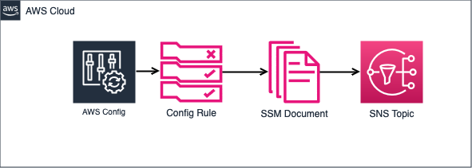

# terraform-aws-config-remediation-rules

[](https://github.com/rhythmictech/terraform-aws-config-remediation-rules/actions/workflows/tflint.yaml)
[](https://github.com/rhythmictech/terraform-aws-config-remediation-rules/actions/workflows/trivy.yaml)
[](https://github.com/rhythmictech/terraform-aws-config-remediation-rules/actions/workflows/yamllint.yaml)
[](https://github.com/rhythmictech/terraform-aws-config-remediation-rules/actions/workflows/mispell.yaml)
[](https://github.com/rhythmictech/terraform-aws-config-remediation-rules/actions/workflows/pre-commit-check.yaml)
<a href="https://twitter.com/intent/follow?screen_name=RhythmicTech"></a>

## Example
Here's what using the module will look like
```hcl
module "config_remediation_rules" {
  source = "rhythmictech/config-remediation-rules/aws"
  
  name = "example-remediation-rules"
  enable_nat_gateway_deletion = true
  
  tags = {
    Environment = "Production"
    Project     = "ExampleProject"
  }
}
```

## About
This module provides AWS Config remediation rules tied to automations in SSM. These are meant to be a starting point for automated remediations.  

### Features
- Automatic deletion of NAT Gateways upon creation (optional)
- Automatic deletion of resources (except load balancers) created in public subnets (optional)
- Automatic shutdown of EC2 instances created with unencrypted root volumes (optional)
- Automatic deletion of Lambda functions not associated with a VPC (optional)
- Automatic enabling of S3 bucket public access block for newly created buckets (optional)
- Automatic deletion of security group rules allowing 0.0.0.0/0 access to admin or database ports (optional)


## NAT Gateway Deletion Feature
When enabled, this module creates an AWS Config rule that detects the creation of NAT Gateways. Upon detection, it triggers an SSM Automation document to delete the NAT Gateway. This feature is disabled by default and can be enabled by setting `enable_nat_gateway_deletion = true`.

**Note:** Use this feature with caution, as it will delete all newly created NAT Gateways in the AWS account where it's deployed.

## Public Subnet Resource Deletion Feature
When enabled, this module creates an AWS Config rule that detects the creation of resources in public subnets, except for load balancers. Upon detection, it triggers an SSM Automation document to delete or stop the resource. This feature is disabled by default and can be enabled by setting `enable_public_subnet_resource_deletion = true`.

Supported resource types:
- EC2 Instances (terminated)
- RDS Instances (deleted)
- ECS Tasks (stopped)

**Note:** Use this feature with caution, as it will delete or stop all newly created resources of the supported types (except load balancers) in public subnets in the AWS account where it's deployed.

## Unencrypted Root Volume Shutdown Feature
When enabled, this module creates an AWS Config rule that detects the creation of EC2 instances with unencrypted root volumes. Upon detection, it triggers an SSM Automation document to shut down the instance and send a notification to an SNS topic. This feature is disabled by default and can be enabled by setting `enable_unencrypted_volume_shutdown = true`.

**Note:** Use this feature with caution, as it will shut down all newly created EC2 instances with unencrypted root volumes in the AWS account where it's deployed.

## Non-VPC Lambda Function Deletion Feature
When enabled, this module creates an AWS Config rule that detects the creation of Lambda functions not associated with a VPC. Upon detection, it triggers an SSM Automation document to delete the Lambda function and send a notification to an SNS topic. This feature is disabled by default and can be enabled by setting `enable_non_vpc_lambda_deletion = true`.

**Note:** Use this feature with caution, as it will delete all newly created Lambda functions not associated with a VPC in the AWS account where it's deployed.

## S3 Public Access Block Feature
When enabled, this module creates an AWS Config rule that detects the creation of S3 buckets without public access block enabled. Upon detection, it triggers an SSM Automation document to enable the public access block for the bucket and send a notification to an SNS topic. This feature is disabled by default and can be enabled by setting `enable_s3_public_access_block = true`.

**Note:** This feature will only affect newly created S3 buckets that don't have a public access block configured. It will not modify existing buckets or buckets that already have a public access block policy.

## Security Group Open Port Deletion Feature
When enabled, this module creates an AWS Config rule that detects security group rules allowing 0.0.0.0/0 access to admin or database ports (SSH, RDP, MSSQL, MySQL, PostgreSQL). Upon detection, it triggers an SSM Automation document to delete the offending rules and send a notification to an SNS topic. This feature is disabled by default and can be enabled by setting `enable_sg_open_port_deletion = true`.

**Note:** Use this feature with caution, as it will delete all security group rules allowing 0.0.0.0/0 access to the specified ports in the AWS account where it's deployed.

## Architecture

This architecture diagram illustrates the flow of the AWS Config Remediation Rules module:



1. **AWS Config Rules**: The module creates several AWS Config rules to detect non-compliant resources

2. **AWS Config Remediation**: When a non-compliant resource is detected, AWS Config triggers the corresponding remediation action.

3. **SSM Automation Documents**: The module creates SSM Automation documents for each remediation action

4. **IAM Roles**: Each remediation action has an associated IAM role with the necessary permissions to perform the remediation.

5. **SNS Topic**: If enabled, an SNS topic is created to send notifications about remediation actions.

<!-- BEGINNING OF PRE-COMMIT-TERRAFORM DOCS HOOK -->
## Requirements

| Name | Version |
|------|---------|
| <a name="requirement_terraform"></a> [terraform](#requirement\_terraform) | >= 1.1 |
| <a name="requirement_aws"></a> [aws](#requirement\_aws) | >= 5.0 |

## Providers

| Name | Version |
|------|---------|
| <a name="provider_aws"></a> [aws](#provider\_aws) | 5.73.0 |

## Modules

| Name | Source | Version |
|------|--------|---------|
| <a name="module_tags"></a> [tags](#module\_tags) | rhythmictech/tags/terraform | ~> 1.1 |

## Resources

| Name | Type |
|------|------|
| [aws_config_config_rule.lambda_in_vpc](https://registry.terraform.io/providers/hashicorp/aws/latest/docs/resources/config_config_rule) | resource |
| [aws_config_config_rule.nat_gateway_created](https://registry.terraform.io/providers/hashicorp/aws/latest/docs/resources/config_config_rule) | resource |
| [aws_config_config_rule.public_subnet_resources](https://registry.terraform.io/providers/hashicorp/aws/latest/docs/resources/config_config_rule) | resource |
| [aws_config_config_rule.s3_public_access_block](https://registry.terraform.io/providers/hashicorp/aws/latest/docs/resources/config_config_rule) | resource |
| [aws_config_config_rule.sg_open_admin_db_ports](https://registry.terraform.io/providers/hashicorp/aws/latest/docs/resources/config_config_rule) | resource |
| [aws_config_config_rule.unencrypted_root_volume](https://registry.terraform.io/providers/hashicorp/aws/latest/docs/resources/config_config_rule) | resource |
| [aws_config_remediation_configuration.delete_nat_gateway](https://registry.terraform.io/providers/hashicorp/aws/latest/docs/resources/config_remediation_configuration) | resource |
| [aws_config_remediation_configuration.delete_non_vpc_lambda](https://registry.terraform.io/providers/hashicorp/aws/latest/docs/resources/config_remediation_configuration) | resource |
| [aws_config_remediation_configuration.delete_open_admin_db_ports](https://registry.terraform.io/providers/hashicorp/aws/latest/docs/resources/config_remediation_configuration) | resource |
| [aws_config_remediation_configuration.delete_public_subnet_resource](https://registry.terraform.io/providers/hashicorp/aws/latest/docs/resources/config_remediation_configuration) | resource |
| [aws_config_remediation_configuration.enable_s3_public_access_block](https://registry.terraform.io/providers/hashicorp/aws/latest/docs/resources/config_remediation_configuration) | resource |
| [aws_config_remediation_configuration.shutdown_unencrypted_instance](https://registry.terraform.io/providers/hashicorp/aws/latest/docs/resources/config_remediation_configuration) | resource |
| [aws_iam_role.delete_nat_gateway](https://registry.terraform.io/providers/hashicorp/aws/latest/docs/resources/iam_role) | resource |
| [aws_iam_role.delete_non_vpc_lambda](https://registry.terraform.io/providers/hashicorp/aws/latest/docs/resources/iam_role) | resource |
| [aws_iam_role.delete_open_admin_db_ports](https://registry.terraform.io/providers/hashicorp/aws/latest/docs/resources/iam_role) | resource |
| [aws_iam_role.delete_public_subnet_resource](https://registry.terraform.io/providers/hashicorp/aws/latest/docs/resources/iam_role) | resource |
| [aws_iam_role.enable_s3_public_access_block](https://registry.terraform.io/providers/hashicorp/aws/latest/docs/resources/iam_role) | resource |
| [aws_iam_role.shutdown_unencrypted_instance](https://registry.terraform.io/providers/hashicorp/aws/latest/docs/resources/iam_role) | resource |
| [aws_iam_role_policy.delete_nat_gateway](https://registry.terraform.io/providers/hashicorp/aws/latest/docs/resources/iam_role_policy) | resource |
| [aws_iam_role_policy.delete_nat_gateway_publish_to_sns](https://registry.terraform.io/providers/hashicorp/aws/latest/docs/resources/iam_role_policy) | resource |
| [aws_iam_role_policy.delete_non_vpc_lambda_publish_to_sns](https://registry.terraform.io/providers/hashicorp/aws/latest/docs/resources/iam_role_policy) | resource |
| [aws_iam_role_policy.delete_open_admin_db_ports](https://registry.terraform.io/providers/hashicorp/aws/latest/docs/resources/iam_role_policy) | resource |
| [aws_iam_role_policy.delete_open_admin_db_ports_publish_to_sns](https://registry.terraform.io/providers/hashicorp/aws/latest/docs/resources/iam_role_policy) | resource |
| [aws_iam_role_policy.delete_public_subnet_resource](https://registry.terraform.io/providers/hashicorp/aws/latest/docs/resources/iam_role_policy) | resource |
| [aws_iam_role_policy.delete_public_subnet_resource_publish_to_sns](https://registry.terraform.io/providers/hashicorp/aws/latest/docs/resources/iam_role_policy) | resource |
| [aws_iam_role_policy.enable_s3_public_access_block](https://registry.terraform.io/providers/hashicorp/aws/latest/docs/resources/iam_role_policy) | resource |
| [aws_iam_role_policy.enable_s3_public_access_block_publish_to_sns](https://registry.terraform.io/providers/hashicorp/aws/latest/docs/resources/iam_role_policy) | resource |
| [aws_iam_role_policy.non_vpc_lambda_remediation_policy](https://registry.terraform.io/providers/hashicorp/aws/latest/docs/resources/iam_role_policy) | resource |
| [aws_iam_role_policy.shutdown_unencrypted_instance](https://registry.terraform.io/providers/hashicorp/aws/latest/docs/resources/iam_role_policy) | resource |
| [aws_iam_role_policy.shutdown_unencrypted_instance_publish_to_sns](https://registry.terraform.io/providers/hashicorp/aws/latest/docs/resources/iam_role_policy) | resource |
| [aws_sns_topic.admin_notifications](https://registry.terraform.io/providers/hashicorp/aws/latest/docs/resources/sns_topic) | resource |
| [aws_ssm_document.delete_nat_gateway](https://registry.terraform.io/providers/hashicorp/aws/latest/docs/resources/ssm_document) | resource |
| [aws_ssm_document.delete_non_vpc_lambda](https://registry.terraform.io/providers/hashicorp/aws/latest/docs/resources/ssm_document) | resource |
| [aws_ssm_document.delete_open_admin_db_ports](https://registry.terraform.io/providers/hashicorp/aws/latest/docs/resources/ssm_document) | resource |
| [aws_ssm_document.delete_public_subnet_resource](https://registry.terraform.io/providers/hashicorp/aws/latest/docs/resources/ssm_document) | resource |
| [aws_ssm_document.enable_s3_public_access_block](https://registry.terraform.io/providers/hashicorp/aws/latest/docs/resources/ssm_document) | resource |
| [aws_ssm_document.shutdown_unencrypted_instance](https://registry.terraform.io/providers/hashicorp/aws/latest/docs/resources/ssm_document) | resource |
| [aws_caller_identity.current](https://registry.terraform.io/providers/hashicorp/aws/latest/docs/data-sources/caller_identity) | data source |
| [aws_iam_policy_document.assume_role](https://registry.terraform.io/providers/hashicorp/aws/latest/docs/data-sources/iam_policy_document) | data source |
| [aws_iam_policy_document.delete_open_admin_db_ports](https://registry.terraform.io/providers/hashicorp/aws/latest/docs/data-sources/iam_policy_document) | data source |
| [aws_iam_policy_document.delete_public_subnet_resource](https://registry.terraform.io/providers/hashicorp/aws/latest/docs/data-sources/iam_policy_document) | data source |
| [aws_iam_policy_document.enable_s3_public_access_block](https://registry.terraform.io/providers/hashicorp/aws/latest/docs/data-sources/iam_policy_document) | data source |
| [aws_iam_policy_document.non_vpc_lambda_remediation_policy](https://registry.terraform.io/providers/hashicorp/aws/latest/docs/data-sources/iam_policy_document) | data source |
| [aws_iam_policy_document.publish_to_sns](https://registry.terraform.io/providers/hashicorp/aws/latest/docs/data-sources/iam_policy_document) | data source |
| [aws_iam_policy_document.remediation_policy](https://registry.terraform.io/providers/hashicorp/aws/latest/docs/data-sources/iam_policy_document) | data source |
| [aws_iam_policy_document.shutdown_unencrypted_instance](https://registry.terraform.io/providers/hashicorp/aws/latest/docs/data-sources/iam_policy_document) | data source |

## Inputs

| Name | Description | Type | Default | Required |
|------|-------------|------|---------|:--------:|
| <a name="input_enable_nat_gateway_deletion"></a> [enable\_nat\_gateway\_deletion](#input\_enable\_nat\_gateway\_deletion) | Enable the rule to automatically delete NAT Gateways when created | `bool` | `false` | no |
| <a name="input_enable_non_vpc_lambda_deletion"></a> [enable\_non\_vpc\_lambda\_deletion](#input\_enable\_non\_vpc\_lambda\_deletion) | Enable the rule to automatically delete Lambda functions not associated with a VPC | `bool` | `false` | no |
| <a name="input_enable_public_subnet_resource_deletion"></a> [enable\_public\_subnet\_resource\_deletion](#input\_enable\_public\_subnet\_resource\_deletion) | Enable the rule to automatically delete resources (except load balancers) created in public subnets | `bool` | `false` | no |
| <a name="input_enable_s3_public_access_block"></a> [enable\_s3\_public\_access\_block](#input\_enable\_s3\_public\_access\_block) | Enable the rule to automatically enable public access block for S3 buckets created without it | `bool` | `false` | no |
| <a name="input_enable_sg_open_port_deletion"></a> [enable\_sg\_open\_port\_deletion](#input\_enable\_sg\_open\_port\_deletion) | Enable the rule to automatically delete security group rules allowing 0.0.0.0/0 access to admin or database ports | `bool` | `false` | no |
| <a name="input_enable_sns_notifications"></a> [enable\_sns\_notifications](#input\_enable\_sns\_notifications) | Enable SNS notifications for remediation actions | `bool` | `false` | no |
| <a name="input_enable_unencrypted_volume_shutdown"></a> [enable\_unencrypted\_volume\_shutdown](#input\_enable\_unencrypted\_volume\_shutdown) | Enable the rule to automatically shut down EC2 instances created with unencrypted root volumes | `bool` | `false` | no |
| <a name="input_name"></a> [name](#input\_name) | Moniker to apply to all resources in the module | `string` | n/a | yes |
| <a name="input_tags"></a> [tags](#input\_tags) | User-Defined tags | `map(string)` | `{}` | no |

## Outputs

| Name | Description |
|------|-------------|
| <a name="output_tags_module"></a> [tags\_module](#output\_tags\_module) | Tags Module in it's entirety |
<!-- END OF PRE-COMMIT-TERRAFORM DOCS HOOK -->
